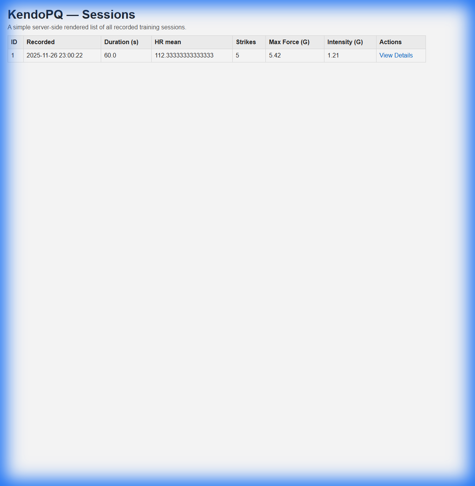
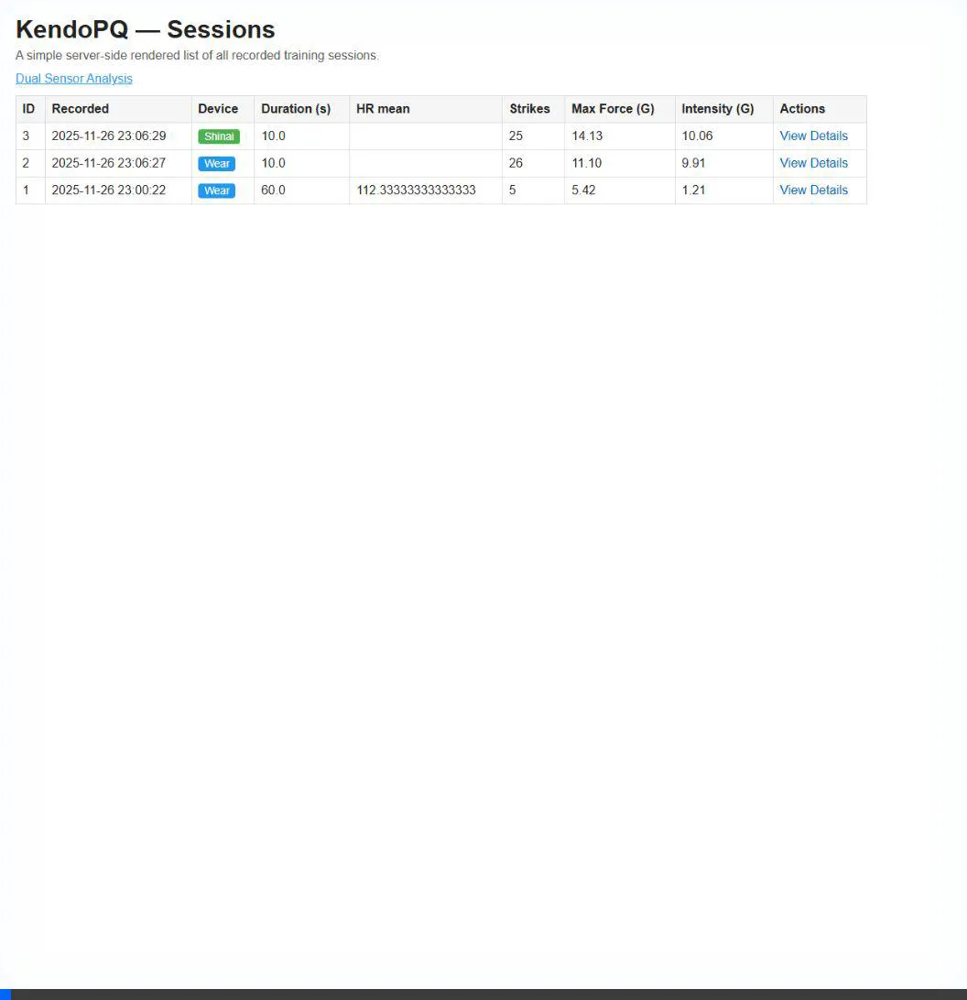

# UCSD-CSE-118-Team-1 - Kendo Training Analysis Server

Raspberry Pi server for analyzing Kendo training sessions using dual-device IMU and heart rate data.

## Features

### Single Device Analysis
- **Heart Rate Zones**: Automatically categorizes time spent in Resting, Fat Burn, Cardio, and Peak zones
- **Movement Intensity**: Calculates average and maximum acceleration intensity
- **Strike Detection**: Identifies sword strikes using peak detection on accelerometer data
- **Strike Metrics**: Measures force (G) for each strike, including max and average force
- Real-time console output for each session upload

### Dual Device Analysis
Combines data from wrist watch and shinai sensor for advanced physics-based metrics:
- **Tip Speed**: Calculates sword tip velocity using angular velocity (v = ω × r)
- **Kinetic Energy**: Computes strike energy based on tip speed and sword weight
- **Straightness**: Analyzes strike trajectory variance to measure how straight the strike is
- **Consistency**: Compares consecutive strikes to measure technique consistency

### Web Interface
- Dashboard showing all sessions with device type badges (Wear/Shinai)
- Individual session details with full metrics
- Dual Sensor Analysis page for selecting session pairs and viewing physics results
- Access at `http://<raspberry-pi-ip>:5000/`

## Setup

### Installation

```bash
python3 -m venv venv
source venv/bin/activate
pip install -r requirements.txt
```

Requirements:
- Flask >= 2.0
- numpy (for dual analysis)

### Running the Server

```bash
python sensor_server.py
# Server will run on http://0.0.0.0:5000
```

## API Endpoints

### POST /end
Receives session data from watch apps and performs analysis.

**Request Headers:**
- Content-Type: application/json

**Request Body (Wear App):**
```json
{
  "heart_rates": [{ "t": 500, "bpm": 94 }, { "t": 1000, "bpm": 95 }],
  "imu": [{ "t": 160, "ax": 1.8, "ay": 0.1, "az": 9.3, "gx": 0.01, "gy": 0.0, "gz": 0.0 }],
  "rotation_vectors": [{"x": 0.119, "y": -0.099, "z": 0.124, "w": 0.979}],
  "duration": 60,
  "heart_rate_hz": 1,
  "imu_hz": 20
}
```

**Request Body (Shinai App):**
```json
{
  "device_id": "wrist_watch_B",
  "data_type": "imu_only",
  "imu": [{ "t": 160, "ax": 1.8, "ay": 0.1, "az": 9.3, "gx": 0.01, "gy": 0.0, "gz": 0.0 }],
  "duration": 60,
  "imu_hz": 20
}
```

### POST /analyze_dual
Analyzes a pair of sessions (wear + shinai) for dual-device metrics.

**Request Body:**
```json
{
  "wear_session_id": "session_2025-11-26_22-00-00_123456.json",
  "shinai_session_id": "session_2025-11-26_22-00-05_234567.json",
  "distance_inches": 30,
  "sword_weight_lbs": 1.1
}
```

**Response:**
```json
{
  "status": "success",
  "report": {
    "max_tip_speed_mps": 15.2,
    "max_kinetic_energy_joules": 127.5,
    "straightness_score": 0.95,
    "consistency_score": 0.82
  }
}
```

## Web Routes

- `GET /` - Sessions dashboard with device badges
- `GET /session/<id>` - Detailed session view
- `GET /dual_analysis` - Dual sensor analysis form
- `POST /analyze_dual_web` - Submit dual analysis and view results

## Data Storage

### File Structure
- `data/raw_data/` - Original JSON payloads from watch apps
- `data/processed_data/` - Processed CSV files (IMU and heart rate)
- `data/sessions.db` - SQLite database with session metadata and analysis results

### Database Schema

```sql
CREATE TABLE sessions (
    id INTEGER PRIMARY KEY,
    created_at INTEGER,           -- Unix timestamp
    raw_filename TEXT,            -- Raw JSON filename
    imu_csv TEXT,                 -- Processed IMU CSV
    heart_csv TEXT,               -- Processed heart rate CSV
    duration REAL,                -- Session duration (seconds)
    imu_hz_measured REAL,
    imu_hz_sampling_rate_defined REAL,
    heart_rate_hz_measured REAL,
    heart_rate_hz_sampling_rate REAL,
    heart_mean REAL,              -- Average heart rate (bpm)
    heart_max INTEGER,            -- Maximum heart rate (bpm)
    device_type TEXT,             -- 'wear' or 'shinai'
    strike_count INTEGER,         -- Number of strikes detected
    max_strike_force REAL,        -- Maximum strike force (G)
    avg_strike_force REAL,        -- Average strike force (G)
    avg_intensity REAL,           -- Average movement intensity (G)
    max_intensity REAL            -- Maximum movement intensity (G)
);
```

## Analysis Algorithms

### Strike Detection
- **Method**: Peak detection on accelerometer magnitude
- **Threshold**: 2.0 G (configurable)
- **Min Distance**: 200ms between strikes to prevent double-counting
- **Output**: Strike count, max/avg force, timestamps

### Dual Device Physics
- **Tip Speed**: Uses wrist gyroscope and distance to calculate v = ω × r
- **Kinetic Energy**: E = 0.5 × m × v²
- **Straightness**: 1.0 - (variance_minor / variance_major) on acceleration axes
- **Consistency**: Correlation between consecutive strike profiles

## Visual Demonstrations

### Web Interface

The dashboard shows all sessions with color-coded device badges and analysis metrics:



### Dual Sensor Analysis Workflow

Complete workflow showing session selection, parameter input, and results visualization:



## Console Output Example

```
========================================
       SESSION ANALYSIS REPORT
========================================

[Heart Rate Analysis]
Average HR: 125.3 bpm
Max HR:     165.0 bpm
Time in Zones (samples):
  - Resting/Warm Up (<100): 15
  - Fat Burn (100-130): 45
  - Cardio (130-150): 30
  - Peak (>150): 10

[Movement & Kendo Analysis]
Average Intensity: 1.85 G
Max Intensity:     5.42 G
Kendo Strikes:     12
Max Strike Force:  5.42 G
Avg Strike Force:  4.87 G

========================================
```


